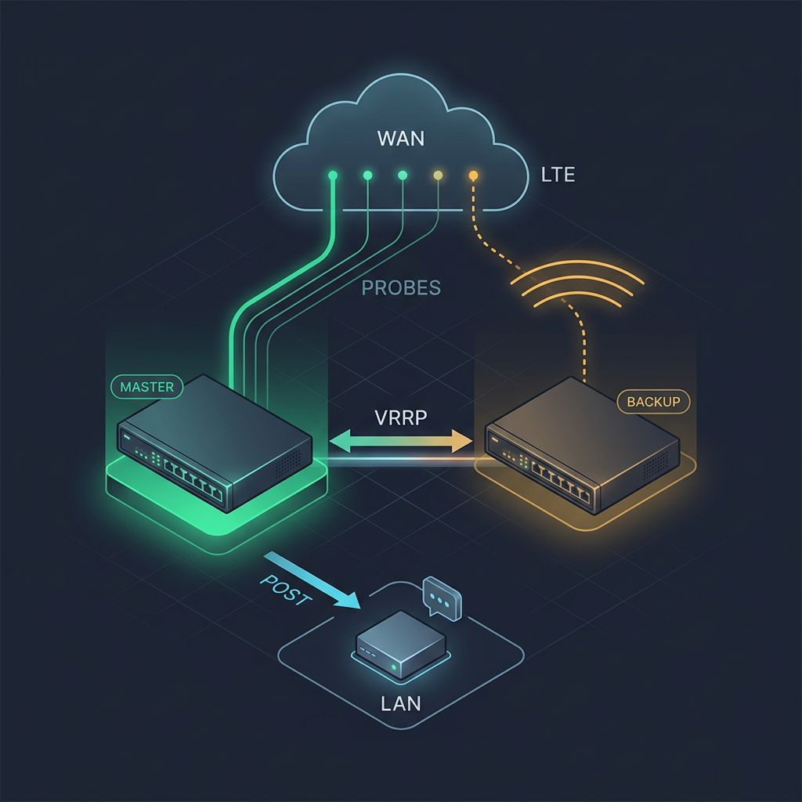

# Design notes

Why `wanqm` looks the way it does. The README tells you how to run it; this document
explains the reasoning, the numbers, and the things production forced us to change.

<p align="center">
  
</p>

The notification arrow pointing *down into the LAN* rather than out to the cloud is
the whole point of section 8: the webhook is local, so the alert about a WAN outage
still leaves the building while that WAN is down.

## 1. The problem

A single Netwatch entry watching the ISP gateway is the standard MikroTik answer to WAN
failover. It is also binary and stateless: it knows `up` and `down`, it has no rolling
window between intervals, and it cannot aggregate several targets.

With `thr-avg=16ms` / `thr-loss-percent=9%` on a 5 s interval, a one-to-two second
disturbance — the kind a cable link produces several times a week — was enough to flip
mastership, send mail, and toggle DHCP. The failover worked; it just fired for things
that were not outages.

The acceptance criteria for the replacement were:

1. a 1–2 s disturbance must not change master/backup;
2. genuine degradation (loss/RTT/jitter sustained over tens of seconds) must lower the
   priority and hand over mastership;
3. transitions must be rare, justified, and hysteretic;
4. adding a probe or a second link must be easy.

The model is FortiGate SD-WAN Performance SLA: measure continuously, judge over a window,
and separate *measuring* from *acting*.

## 2. What RouterOS 7 actually gives you

| Tool | What you get | Limits / role here |
|---|---|---|
| `/tool/netwatch` type `icmp` | `interval`, `thr-avg`, `thr-jitter`, `thr-stdev`, `thr-loss-percent`, `packet-count`; scripts see `$rtt-avg`, `$rtt-jitter`, `$loss-percent` | Binary up/down per host, no rolling window across intervals, no aggregation of several hosts. Role: **emergency fuse**, not the decision engine |
| `/tool/netwatch` type `tcp-conn`, `http-get`, `dns` | L4/L7 reachability, HTTP status codes | Same — binary; useful as an auxiliary probe |
| `/ping ... as-value` in a script | per-packet RTT and status — full control: compute your own avg / jitter / loss | Needs your own script and windows kept in globals. This is the **main measurement engine** |
| `/tool/fetch` | HTTP(S) probe, success/failure (timing indirectly via `:time`) | No per-packet RTT; an L7 probe (one target is enough) |
| `:resolve server=...` | DNS probe timed with `:time` | Same |
| `/system/scheduler` | run scripts periodically (1 s minimum) | The basis of the measurement and decision loops |
| Global variables | state persists between script runs (until reboot) | Lost on reboot → a cold start is required |
| Passively: interface counters, link status, connection count, traffic-flow | link state, L2 errors, flow export | RouterOS does **not** passively measure RTT/loss of real sessions (unlike FortiGate passive WAN health). Passive signals are only disqualifiers (link down, error storm) |

**Conclusion:** active measurement from your own script is the source of truth; Netwatch
stays purely as an independent fuse for a hard DOWN.

## 3. Architecture

```
┌────────────────────────────────────────────────────────────┐
│ CONFIG LAYER (wanqm-config)                                │
│  links, probes per link, SLA thresholds, windows,          │
│  hysteresis, VRRP priority map                             │
└──────────────┬─────────────────────────────────────────────┘
               ▼
┌────────────────────────────────────────────────────────────┐
│ MEASUREMENT LAYER (scheduler every TICK=10s → wanqm-probe) │
│  P1 ICMP ISP gateway   P2 ICMP anycast resolver            │
│  P3 ICMP second resolver   P4 ICMP own remote host         │
│  → per probe: 5 pings/tick → RTT[], sent, recv             │
│  → push sample into the rolling window (globals)           │
│  → heartbeat: WanQmHeartbeat = now                         │
└──────────────┬─────────────────────────────────────────────┘
               ▼  (reads measurements only)
┌────────────────────────────────────────────────────────────┐
│ AGGREGATION + FSM (same tick, right after measuring)       │
│  - avgRTT, jitter, loss% per probe (long + short window)   │
│  - per-probe verdict: OK / DEGRADED / FAIL                 │
│  - vote: LINK state = f(majority of probes)                │
│  - state machine GOOD/DEGRADED/BAD with hysteresis + dwell │
│  → result: WanQmState, WanQmStateSince                     │
└──────────────┬─────────────────────────────────────────────┘
               ▼  (separate scheduler every 20s → wanqm-orchestrator)
┌────────────────────────────────────────────────────────────┐
│ VRRP ORCHESTRATOR                                          │
│  - reads WanQmState (+ heartbeat freshness!)               │
│  - maps state → target priority                            │
│  - damping: hold-down after a change, slower up than down  │
│  - /interface/vrrp/set <name> priority=X + log + notify    │
└────────────────────────────────────────────────────────────┘
  in parallel, independently:
  • netwatch fuse: ICMP to 2 targets, very lax thresholds,
    down-script forces the BAD priority (hard link DOWN)
  • wanqm-watchdog (60s): heartbeat freshness, re-init logic
  • wanqm-report (5 min): rollup log + export
```

Three rules hold the whole thing together:

- Measurement **never** touches VRRP. The layers communicate one way only, through globals.
- The orchestrator is the **only** writer of `priority` — except the netwatch fuse, which
  may only ever *lower* it.
- A link verdict requires **a majority of probes** to agree. One dead target (say, an
  anycast resolver having a bad day) does not change the link state.

## 4. Measurement layer

### Probes

| Probe | Target | Why |
|---|---|---|
| P1 | ISP gateway | first-mile quality — the most sensitive indicator of a link problem |
| P2 | a public anycast resolver | transit quality, independent of the ISP |
| P3 | a second resolver, different operator | tells a dead host from a dead link |
| P4 | your own remote host | end-to-end over the path that actually carries production traffic. Note: a single server — in the vote it must never be able to trigger a failover alone, hence FAIL ≥ 3 of 4 |

The count is fixed at four. `wanqm-probe` unrolls the four measurements rather than looping
over the target list, and the vote reads exactly four verdicts, so a fifth target is never
read and a missing fourth one degrades into a permanently failing probe that eats a vote.
Changing the number means touching the unrolled blocks, the window globals in `wanqm-init`
and the vote — deliberately, since a loop would have cost readability in the one script that
must never throw.

With a second WAN link, every probe needs an explicit `src-address` or routing through the
link under test — a separate routing table plus `routing-mark`/VRF per link.

### Rolling windows

- **Tick = 10 s**, 5 pings at `interval=200ms` per target (~1 s per target, ~3 s
  sequentially — comfortably inside the tick).
- **Long window L = 12 ticks (~2 min, 60 packets per target)** → avgRTT, jitter, loss for
  the GOOD/DEGRADED judgement. Long enough that a 1–2 s spike (5–10 packets at most) is
  under 10–15 % of the window.
- **Short window S = 3 ticks (30 s, 15 packets per target)** → fast detection of BAD/DOWN;
  a hard outage has to be visible in under a minute.
- Storage: per probe, an array of the last L samples `{sent, recv, rttAvgUs, rttJitterUs}`.
  Jitter is computed per tick as the mean `|RTT(i) − RTT(i−1)|` inside the 5-ping burst,
  then averaged across the window. FIFO: append, trim to L.

## 5. Link state: verdicts, voting, FSM

### Per-probe verdict (every tick, from the windows)

| Verdict | Condition (long window L unless stated) |
|---|---|
| `FAIL` | loss(S) ≥ 60 % **or** recv(S) = 0 |
| `DEGRADED` | loss(L) ≥ 5 % **or** avgRTT(L) ≥ 40 ms **or** jitter(L) ≥ 15 ms |
| `OK` | loss(L) < 2 % **and** avgRTT(L) < 25 ms **and** jitter(L) < 8 ms |
| dead zone | between the OK and DEGRADED thresholds → keep the previous verdict |

The dead zone is threshold hysteresis: a probe sitting exactly on a boundary does not
oscillate between verdicts and pump noise into the vote.

> Calibrate the RTT thresholds. Run `wanqm-report` for a week, then set
> OK ≈ p95 of normal RTT plus margin, and DEGRADED ≈ 2× baseline.

### Voting

- `LINK_FAIL` — ≥ 3 of 4 probes are FAIL, **or** the WAN interface is physically down
  (immediate, no window). Tolerates one dead target, including a solo failure of your own
  remote host. A real upstream outage puts P2+P3+P4 in FAIL, so failover still happens.
- `LINK_DEGRADED` — ≥ 2 of 4 probes are DEGRADED or worse.
- `LINK_OK` — everything else.

Both thresholds are configurable (`WanQmCfgVoteFail`, `WanQmCfgVoteDeg`).

### State machine with dwell times

| Transition | Condition | Rationale |
|---|---|---|
| GOOD → DEGRADED | LINK_DEGRADED for 3 consecutive ticks (30 s) | a 1–2 s spike vanishes in the window; 30 s confirms a trend |
| DEGRADED → BAD | LINK_FAIL for 2 consecutive ticks (20 s) | a hard outage should fail fast |
| GOOD → BAD (shortcut) | LINK_FAIL for 2 ticks **or** physical link down | do not walk through DEGRADED when the link is severed |
| BAD → DEGRADED | LINK_DEGRADED-or-better for 6 consecutive ticks (60 s) | recovery is slower than failure (failtime < recoverytime, as in FortiGate) |
| DEGRADED → GOOD | LINK_OK for 12 consecutive ticks (~2 min) **and** at least 60 s spent in DEGRADED | asymmetry: promote only after a full clean window |
| all states | minimum dwell of 30 s | kills FSM ping-pong |

## 6. Mapping to VRRP

Priorities must *straddle* the backup router's priority, otherwise lowering ours changes
nothing. With a backup holding a static 70:

| State | Priority | Effect |
|---|---|---|
| GOOD | 80 | master |
| DEGRADED | **never lowered** | alert only — normally no write at all; see below |
| BAD | 30 | hands mastership to the backup |
| UNKNOWN (no fresh measurements) | untouched | fail-safe: never raise blindly |

### Why DEGRADED does not touch VRRP

The original design had DEGRADED lower the priority to 75 — "one step from handing over".
In production that turned out to be both useless and harmful:

- 75 was still above the backup's 70, so it protected nothing operationally;
- **every** write to `/interface vrrp set priority` resets the VRRP FSM on RouterOS,
  producing a spurious BACKUP→MASTER flip (plus mail and a DHCP toggle) regardless of
  whether the new value actually threatens mastership.

A mild GOOD→DEGRADED→GOOD excursion (3–8 % loss, never FAIL) produced two spurious flips
in four minutes.

DEGRADED's target is now `PrioGood` itself. In the normal case the current priority
*already is* `PrioGood`, so `target == cur`, the write is skipped, and the effect is
exactly "do nothing" — no write, no FSM reset. But it is deliberately not coded as "do
nothing", because of one case: after the fuse has emergency-dropped the priority to 30, a
DEGRADED state is proof that the link is alive again, and the orchestrator can raise it
back (as a raise, subject to the full hold-down). Coded as a literal no-op, the priority
would sit at 30 for the entire DEGRADED period, pinning traffic on the metered backup long
after the outage ended. DEGRADED can never *lower* the priority, because `PrioGood` is the
maximum value in the map.

### Damping

- **Hold-down 60 s** after any priority change before the next one. Exception: a transition
  to BAD is always applied immediately.
- **Raising is a single jump straight to the target** (30 → 80), not a staircase. Same
  reason as above: every write resets the VRRP FSM, so 30 → 75 → 80 turned one real
  incident into two visible flaps. Even the 75 → 80 step (delta 5, both values above the
  backup) triggered a full on-backup/on-master cycle.
- **Flap counter**: 3 or more priority changes within 15 minutes freezes raising for 30
  minutes and sends an alert — the equivalent of FortiGate's flap penalty.

### The backup router does not get a score model

It is tempting to run the same machinery on the standby router and let the two negotiate
by score. We deliberately do not.

If the backup link is metered (ours is capped monthly while the primary is not), the
primary must hold mastership whenever it is not in BAD — *regardless* of how well the
backup measures. A backup with its own priority map risks the opposite outcome: a
carefully unlucky set of values where the backup outbids a perfectly healthy primary.

So the backup runs `wanqm` for measurement, logging and alerting only. Its orchestrator is
disabled permanently, its priority is static, and its only means of changing it is the
fuse — downward, in an emergency.

## 7. On-router structure

| Element | Type | Interval | Role |
|---|---|---|---|
| `wanqm-config` | script | called by the others | declarations only: targets, thresholds, windows, priority map — the only file you edit |
| `wanqm-probe` | script + scheduler | 10 s | measurement + aggregation + FSM; writes globals only |
| `wanqm-orchestrator` | script + scheduler | 20 s | the only writer of VRRP priority |
| `wanqm-watchdog` | script + scheduler | 60 s | heartbeat freshness; stale → log error + alert + re-init |
| `wanqm-report` | script + scheduler | 5 min | rollup log + export |
| `wanqm-notify` | script | on demand | the single notification funnel + incident correlation |
| `wanqm-init` | script + scheduler `start-time=startup` | once per boot | cold start: state UNKNOWN, clean windows, **no priority writes** for the first ~2 min |
| netwatch fuse | 2× `/tool/netwatch` | 10 s, `thr-loss-percent=80` | down-script forces the BAD priority — but only if **both** targets are down **and** the measurement is dead |

Globals live in the `WanQm*` namespace: `WanQmCfg*`, `WanQmW1..4{sent,recv,rtt,jit}`,
`WanQmVerd1..4`, `WanQmState`, `WanQmStateSince`, `WanQmCondStreak`, `WanQmHeartbeat`,
`WanQmLastPrioChange`, `WanQmPrioHist`, `WanQmIncident*`, `WanQmFusePending`.

### Resilience

- Every script is wrapped in `:do {...} on-error={:log error ...}` — one failed tick does
  not stop the mechanism. A missing sample is semantically just a lost packet in the window.
- The orchestrator trusts the state only while the heartbeat is fresh, so a dead
  measurement can never raise the priority.
- After a reboot: UNKNOWN plus a ~2 min grace period. VRRP starts from its statically
  configured priority, so there is no sudden jump; if the link really is down, the fuse
  and the first full short window (30 s) drive the state to BAD quickly.
- Maintainability: a new probe is one entry in `wanqm-config`; a new link is a duplicated
  config section plus globals with a link suffix; thresholds live in exactly one place.

### The fuse, and how to get it wrong

The fuse exists for one scenario: the scripts themselves are dead (a bug, an exhausted
scheduler, a broken import) *and* the link is down. Both netwatch entries carry the same
two scripts, and every value they act on — the VRRP interface name, the emergency
priority (`PrioBad`), the restore priority (`PrioGood`) — is read from the config at run
time (the fuse runs `wanqm-config` first, which is why that one script is installed with
`policy=read` only: a netwatch script has no `policy` policy and cannot run a script
whose policies exceed its own). The "both targets down" gate counts `down` entries among
`comment~"^wanqm-fuse-"` — when a down-script fires, its own entry is already `down`, so
a count of ≥ 2 means "me and my partner". Three mistakes we made:

1. **Ungated**, it bypassed the hysteresis and fought the orchestrator, producing VRRP
   flaps. The obvious gate — fire only when `WanQmHeartbeat` is stale — turned out to be
   an illusion: **netwatch scripts run in their own global-variable environment**, fully
   isolated from the schedulers' one (verified on ROS 7.24 in both directions, including
   via `/system script environment`), so the fuse could never see the heartbeat and
   silently considered the measurement dead every time. What netwatch *can* see is
   configuration state, so the gate is now built from that, in three steps: the
   `wanqm-probe` scheduler disabled or missing → dead; its comment carrying a
   `MEASUREMENT-DEAD` flag → dead (the watchdog, which does see the real heartbeat,
   mirrors its verdict into that comment on transitions — this also catches a probe
   that starts and crashes mid-run); otherwise the probe *script's* `run-count` sampled
   12 s apart — the scheduler starts it every 10 s, so a frozen count means nothing is
   being started.
2. **Without an up-script** on the backup router — whose orchestrator is permanently
   disabled — nothing ever restored the priority. It sat at an emergency 20 for 4.5 days,
   which silently broke failover in the opposite direction: 20 is below the primary's BAD
   floor of 30, so the backup would never have taken over even while healthier. Both
   entries now carry an up-script that restores `PrioGood`, but it acts only where the
   orchestrator scheduler is disabled or absent — where the orchestrator runs, it raises
   the priority itself after the hold-down, and an immediate restore would bypass that
   damping.
3. **Writing unconditionally.** Both netwatch entries fire their scripts, so the priority
   was written repeatedly. Since any VRRP property write resets the FSM for ~9 s, writing
   "the same" value is not a no-op — it is a flap risk. Every writer now guards on
   `cur != target`.

The same environment isolation killed two other pieces of the original design, both
removed rather than kept as dead code. Staging the alert text in a `WanQmFusePending`
global for `wanqm-probe` to relay could never work — the probe cannot see it — so the
fuse now runs `wanqm-notify` directly (verified: `/system script run` and `/tool fetch`
both work from the netwatch context; `wanqm-notify` is installed without the `policy`
policy so the fuse is allowed to call it). And setting `WanQmLastPrioChange` to put the
emergency action under the orchestrator's hold-down was equally invisible; it is no
longer needed, because a correctly gated fuse only ever acts while the measurement is
dead — precisely when the heartbeat-gated orchestrator sees `UNKNOWN` and refuses to
write anything.

## 8. Logging, notifications, export

State transitions are logged at `warning` with full context:

```
[wanqm] wan1 GOOD -> DEGRADED (cond=DEG x3 | p1=DEG loss=6% rtt=34.1ms jit=18.2ms | p2=OK ...)
```

The 5-minute rollup at `info` doubles as calibration data:

```
[wanqm] wan1 state=GOOD prio=80 hb=3s | p1=OK loss=0% rtt=8.1ms jit=0.1ms | ...
```

### Notifications

`wanqm-notify` is the single funnel. Every source — probe, orchestrator, watchdog, fuse —
calls it through the `WanQmNotifySev` / `WanQmNotifyText` globals.

- **Webhook (Telegram, in our case via n8n) — always.** The critical detail is that the
  endpoint is **on the LAN**. The POST therefore needs no internet, so the alert about a
  WAN outage actually arrives *during* the outage. This is the flaw it fixes: the original
  design sent mail over SMTP through the very link that was failing, so the single most
  important alert never made it out.
- **SMS — `sev=crit` only**, through the backup router's LTE modem. Also entirely local.
  Rate-limited both in the webhook backend and locally on the router (900 s).
- **E-mail — demoted to a fallback**, used only when the webhook POST fails.
- **Incident correlation.** The first non-OK alert opens an incident (`#MMDD-HHMM`); each
  following alert appends to a buffer with a relative timestamp; an `ok` alert closes the
  incident and sends the whole timeline as one message. This answers "I have five e-mails
  and I cannot tell whether that was one incident or five" — and unlike SMTP, it guarantees
  chronological order.
- **Secrets** go straight into your `wanqm-config.rsc` — a gitignored copy of a template,
  edited by hand and deleted from the router after import. The optional scripted build
  keeps them in `secrets.local` (chmod 600, gitignored) instead and substitutes the
  `__NAME__` placeholders at build time, so no shipped source ever contains a token.

### Webhook contract

The URL, the headers and the JSON body are all configurable; the method is not. The two
`/tool fetch` calls in `wanqm-notify` render a template before sending:

| | Main channel | SMS channel |
|---|---|---|
| URL | `WanQmCfgNotifyUrl` | `WanQmCfgSmsUrl` |
| Method | `POST` (not configurable) | `POST` (not configurable) |
| Headers | `WanQmCfgNotifyHeaders` | `WanQmCfgSmsHeaders` |
| Body | `WanQmCfgNotifyBody` | `WanQmCfgSmsBody` |
| Certificate | `check-certificate=no` | `check-certificate=no` |
| Fires on | every alert | `sev=crit` only, throttled to 1 per 900 s |

Placeholders are `%MESSAGE%`, `%SEVERITY%`, `%ROUTER%` (system identity), `%LINK%`,
`%INCIDENT%` (empty when no incident is open), `%TOKEN%` (headers) and `%TO%` (SMS). An
empty or unset template falls back to the built-in default, so a config written before
templates existed keeps working.

Three implementation details that matter:

- **`%MESSAGE%` is substituted last.** Alert text routinely contains a `%` (`loss=6%`) and
  could contain something shaped like a placeholder. Substituting the message last means
  nothing carried in it can be expanded a second time. Tested against exactly that case.
- **RouterOS has no substring replace**, so `wanqm-notify` carries a small `fReplace`
  helper built on `:find` and `:pick`. It has a hard iteration guard of 64: this script
  runs on the alerting path, and a runaway loop during an outage would be worse than a
  truncated message.
- **The body is concatenated, not escaped.** There is no JSON builder in RouterOS
  scripting, which is exactly why alert text may contain no `"` and no `\`. Templating the
  shape does not remove that constraint — it only moves the shape into configuration.

A minimal receiver needs to do three things: verify the auth header, read the message
field, and forward it somewhere. Ours is an n8n workflow — webhook node, auth check,
Telegram node. The SMS endpoint additionally calls the backup router's REST API so the
message leaves through its LTE modem, which keeps the whole path independent of the
failing WAN.

### Export

State transitions and the 5-minute rollups all carry the `wanqm` prefix, so the simplest
route out is `/system/logging action=remote` → syslog → whatever stack you already run. If
you want metrics rather than log lines, have `wanqm-report` POST InfluxDB line protocol.

## 9. Multi-WAN

Not implemented, but the shape is deliberate. Configuration becomes a list of links with
measurement and FSM per link (globals suffixed per link), and VRRP priority comes from an
aggregate score — `GOOD:100 / DEGRADED:50 / BAD:0`, weighted, mapped onto the 30–80 range
with the same damping. Choosing a link for *traffic* stays a separate layer: the same
states can drive route `distance` or routing rules, and the orchestrator only ever consumes
the aggregate.
